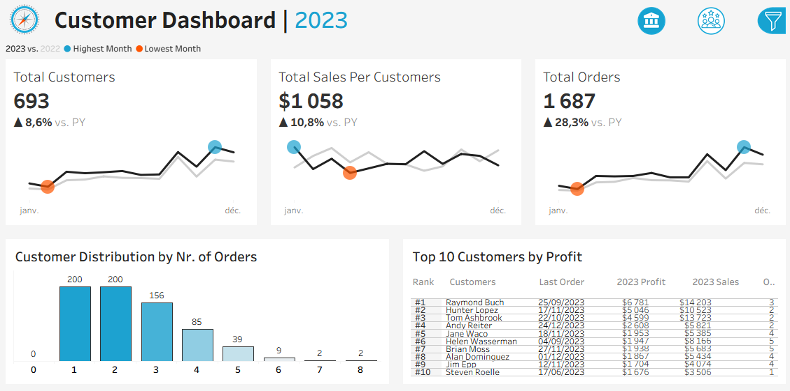
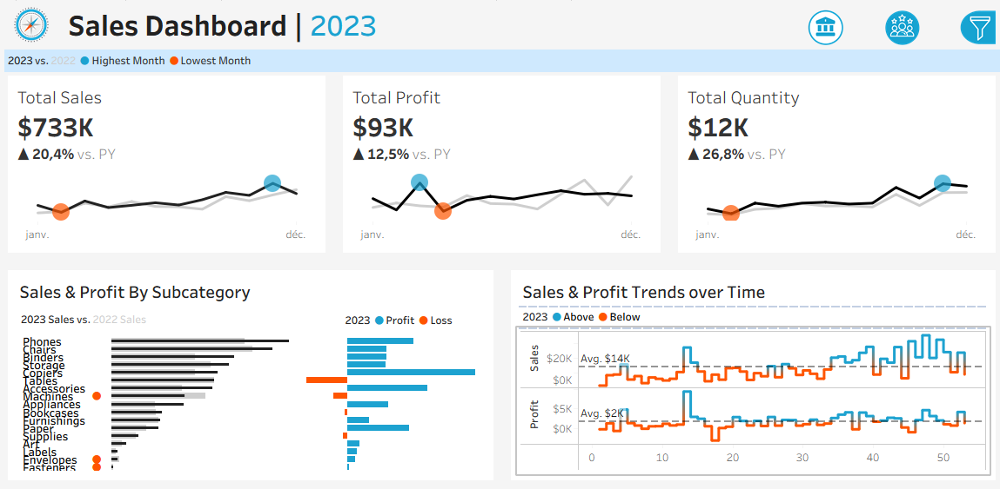
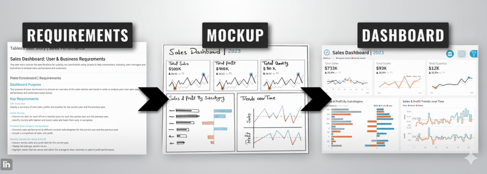

# 📊 Sales & Customer Dashboards (Tableau)

Ce projet présente deux dashboards interactifs réalisés avec **Tableau** :  
- Un **Customer Dashboard** (analyse du comportement et de la fidélité client).  
- Un **Sales Dashboard** (analyse des ventes et de la rentabilité).  

Ces dashboards transforment les données brutes en **insights actionnables** pour la prise de décision.

---

## 📂 Structure du projet

```bash
Sales-Customer-Dashboard/
├── datasets/
│ ├── Customers.csv
│ ├── Location.csv
│ ├── Orders.csv
│ └── Products.csv
│
├── icons/
│ ├── Icon - Customer Dashboard (active).png
│ ├── Icon - Customer Dashboard.png
│ ├── Icon - Filter Hidden.png
│ ├── Icon - Filter Shown.png
│ ├── Icon - Logo.png
│ ├── Icon - Sales Dashboard(active).png
│ └── Icon - Sales Dashboard.png
│
├── images/
│ ├── Costumer_dashboard.png
│ ├── Dashboard Sales Requirements.png
│ ├── Dashboard costumer Requirements.png
│ ├── Sales_Dashboard.png
│ ├── Steps.jpeg
│ ├── Tableau .png
│ └── project_steps.png
│
├── Sales & Customer Dashboards.twbx
├── Salesdshtwb.twb
├── mockupp.pdf
├── projectPhases.pdf
└── ~Sales & Customer Dashboards__52
```


---

## 🎯 Objectifs du projet

- Fournir une **vue claire et interactive** de la performance commerciale et du comportement client.  
- Mettre en avant les **KPI clés** : ventes, profits, quantités, clients, commandes.  
- Identifier les **tendances mensuelles et hebdomadaires**, ainsi que les **meilleurs clients**.  
- Comparer la performance par **sous-catégorie de produits** et par année.  

---

## 🖼️ Aperçu des Dashboards

### 🔹 Customer Dashboard


---

### 🔹 Sales Dashboard


---

## 🛠️ Étapes du projet



---

## 🚀 Fonctionnalités principales

### **Customer Dashboard**
- **KPIs** : Total Clients, Ventes par Client, Total Commandes (2023 vs Année précédente).  
- **Tendances mensuelles** : Evolution des clients, ventes, commandes (avec points min/max).  
- **Distribution des clients par nombre de commandes**.  
- **Top 10 Clients par Profit** : Rang, nombre de commandes, ventes, profits, dernière commande.  

### **Sales Dashboard**
- **KPIs** : Ventes, Profits, Quantités (2023 vs Année précédente).  
- **Tendances hebdomadaires** : Ventes & Profits avec comparaison à la moyenne.  
- **Comparaison des sous-catégories de produits** (ventes et profits).  
- **Analyse mensuelle** : Identification des mois de ventes/profits maximaux et minimaux.  

---

## 🧰 Stack Technique

- **Tableau Desktop** → visualisation et dashboards interactifs  
- **CSV Datasets** (Customers, Orders, Products, Location)  
- **GitHub** → versioning et partage du projet  

---

## 📑 Documentation

- `projectPhases.pdf` → étapes du projet  
- `mockupp.pdf` → maquette initiale des dashboards  
- `Dashboard Sales Requirements.png` → spécifications du Sales Dashboard  
- `Dashboard costumer Requirements.png` → spécifications du Customer Dashboard  

---

## 🚩 Auteurs

👤 **EL-HAJJAJI Anass**   
- [LinkedIn](https://www.linkedin.com/in/el-hajjajianass)
- [X] (https://x.com/AnassElhajjaji)
- 📧 elhajjajianass77@gmail.com  

---

✨ Ce projet démontre l’utilisation de **Tableau** pour transformer des données brutes en insights visuels, utiles pour la prise de décision stratégique.

